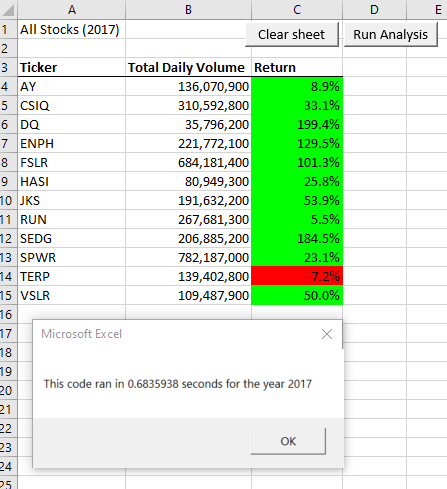
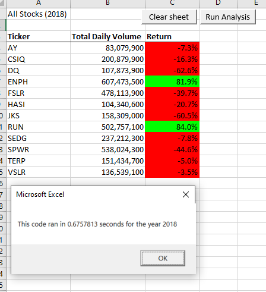

# DQ--Analysis
## Overview of Project

The link for the excel sheet : https://github.com/shantaljambotkar/DQ--Analysis/blob/main/green_stocks.xlsm 

The purpose and background are well defined (2 pt).

## Results

### Code:

Sub AllStocksAnalysisRefactored()
    Dim startTime As Single
    Dim endTime  As Single

    yearValue = InputBox("What year would you like to run the analysis on?")

    startTime = Timer
    
    'Format the output sheet on All Stocks Analysis worksheet
    Worksheets("All Stocks Analysis").Activate
    
    Range("A1").Value = "All Stocks (" + yearValue + ")"
    
    'Create a header row
    Cells(3, 1).Value = "Ticker"
    Cells(3, 2).Value = "Total Daily Volume"
    Cells(3, 3).Value = "Return"

    'Initialize array of all tickers
    Dim tickers(12) As String
    
    tickers(0) = "AY"
    tickers(1) = "CSIQ"
    tickers(2) = "DQ"
    tickers(3) = "ENPH"
    tickers(4) = "FSLR"
    tickers(5) = "HASI"
    tickers(6) = "JKS"
    tickers(7) = "RUN"
    tickers(8) = "SEDG"
    tickers(9) = "SPWR"
    tickers(10) = "TERP"
    tickers(11) = "VSLR"
    
    'Activate data worksheet
    Worksheets(yearValue).Activate
    
    'Get the number of rows to loop over
    RowCount = Cells(Rows.Count, "A").End(xlUp).Row
    
    '1a) Create a ticker Index
    tickerIndex = 0
    
    '1b) Create three output arrays
    Dim tickerVolumes(12) As Long
    Dim tickerStartingPrices(12) As Single
    Dim tickerEndingPrices(12) As Single
    
    ''2a) Create a for loop to initialize the tickerVolumes to zero.
    For tV = 0 To 11
        ticker = tickers(tV)
        tickerVolumes(tV) = 0
        ''MsgBox ("Code run A") ' this is running 12 times
            
        ''2b) Loop over all the rows in the spreadsheet.
        For i = 2 To RowCount
        
            '3a) Increase volume for current ticker
            If Cells(i, 1).Value = ticker Then
                'increase totalvolume
                tickerVolumes(tV) = tickerVolumes(tV) + Cells(i, 8).Value
            End If
            
            '3b) Check if the current row is the first row with the selected tickerIndex.
            'If  Then
            If Cells(i - 1, 1).Value <> ticker And Cells(i, 1).Value = ticker Then
                tickerStartingPrices(tV) = Cells(i, 6).Value
            'End If
            End If
            
            '3c) check if the current row is the last row with the selected ticker
            'If the next row’s ticker doesn’t match, increase the tickerIndex.
            'If  Then
            If Cells(i + 1, 1) <> ticker And Cells(i, 1) = ticker Then
                tickerEndingPrices(tV) = Cells(i, 6)
            End If
            
            '3d Increase the tickerIndex.
                tickerIndex = tickerIndex + 1
            'End If
        
        Next i
    Next tV
    
    '4) Loop through your arrays to output the Ticker, Total Daily Volume, and Return.
    For i = 0 To 11
        
        Worksheets("All Stocks Analysis").Activate
        Cells(4 + i, 1).Value = tickers(i)
        Cells(4 + i, 2).Value = tickerVolumes(i)
        Cells(4 + i, 3).Value = tickerEndingPrices(i) / tickerStartingPrices(i) - 1   
    Next i
    
    'Formatting
    Worksheets("All Stocks Analysis").Activate
    Range("A3:C3").Font.FontStyle = "Bold"
    Range("A3:C3").Borders(xlEdgeBottom).LineStyle = xlContinuous
    Range("B4:B15").NumberFormat = "#,##0"
    Range("C4:C15").NumberFormat = "0.0%"
    Columns("B").AutoFit

    dataRowStart = 4
    dataRowEnd = 15

    For i = dataRowStart To dataRowEnd
        
        If Cells(i, 3) > 0 Then
            Cells(i, 3).Interior.Color = vbGreen
        Else
            Cells(i, 3).Interior.Color = vbRed
        End If
        
    Next i
 
    endTime = Timer
    MsgBox "This code ran in " & (endTime - startTime) & " seconds for the year " & (yearValue)

End Sub

### Screenshot for 2017 Analysis:

### Screenshot for 2018 Analysis:

## Summary

There is a detailed statement on the advantages and disadvantages of refactoring code in general (3 pt).

There is a detailed statement on the advantages and disadvantages of the original and refactored VBA script (3 pt).